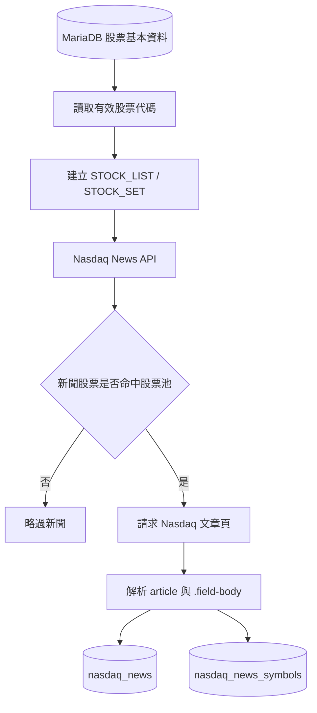

# Nasdaq 股票新聞資料管線

本專案透過 `nasdaq.py` 建立一條以 MariaDB 股票主檔為基礎的 Nasdaq 新聞擷取管線。系統會先從資料庫讀取已建檔的股票代碼，形成受控的股票池，再從 Nasdaq News API 篩選相關新聞、解析文章全文，最後將新聞及其股票關聯寫回 MariaDB。

此設計將「追蹤標的管理」與「新聞擷取邏輯」分離：需要調整追蹤股票時，只需維護資料庫中的股票基本資料，不必修改爬蟲程式碼。

## 核心功能

### 1. 從資料庫動態建立股票池

程式啟動後，會從 MariaDB 的 `api_db.股票基本資料` 讀取所有有效的 `股票代碼`，經過去除空白及轉換大寫後，建立 `STOCK_LIST` 與 `STOCK_SET`。

這代表新聞篩選條件直接由資料庫主檔驅動，避免在程式內硬編碼股票代碼，並確保股票池具有單一、可維護的資料來源（Single Source of Truth）。

### 2. 第一層 Nasdaq API 新聞篩選

程式依頁次呼叫 Nasdaq News API，取得新聞中繼資料，包括：

- 新聞識別碼
- 標題與網址
- 發布日期與時間戳記
- 發布來源與主題
- 新聞摘要
- Nasdaq 標註的相關股票代碼

每篇新聞的股票代碼會先與資料庫股票池進行集合比對。只有至少命中一支追蹤股票的新聞，才會進入文章全文解析階段；未命中的新聞會直接略過。

### 3. 第二層文章全文解析

符合股票池的新聞會進一步請求 Nasdaq 文章頁面，並使用既有且已驗證的 HTML 結構解析正文：

```python
article = soup.find("article")
content = article.select_one(".field-body")
```

正文由 `.field-body` 下的段落組成，清理後以純文字保存。單篇文章若發生 HTTP 錯誤、逾時、缺少 `article` 或缺少 `.field-body`，程式會記錄新聞識別碼、標題、網址及錯誤原因，並繼續處理後續新聞，避免單點失敗中止整批作業。

### 4. 新聞與股票關聯寫入 MariaDB

資料採用新聞主表與股票關聯表分離的正規化設計：

#### `nasdaq_news`

保存新聞本體及全文：

| 欄位 | 說明 |
| --- | --- |
| `news_id` | Nasdaq 新聞唯一識別碼，主鍵 |
| `title` | 新聞標題 |
| `url` | 文章網址 |
| `published_date` | Nasdaq 顯示的發布日期 |
| `published_timestamp` | 原始發布時間戳記 |
| `publisher` | 新聞發布來源 |
| `topic` | 主要新聞主題 |
| `description` | 新聞摘要 |
| `full_text` | 清理後的文章全文 |
| `created_at` | 資料寫入時間 |

#### `nasdaq_news_symbols`

保存新聞與股票之間的多對多關聯：

| 欄位 | 說明 |
| --- | --- |
| `news_id` | 對應 `nasdaq_news.news_id` |
| `symbol` | 命中股票池的股票代碼 |
| `created_at` | 關聯建立時間 |

`news_id + symbol` 使用複合主鍵，確保同一篇新聞與同一支股票的關聯不會重複。

## 資料處理流程



目前 `MAX_PAGES = 3`，預設只掃描前三頁，以便在控制請求量的前提下進行整合測試。

## 冪等性與資料品質

程式可安全重複執行：

- `nasdaq_news.news_id` 為主鍵，相同新聞不會重複新增。
- `nasdaq_news_symbols` 使用 `news_id + symbol` 複合主鍵，相同股票關聯不會重複新增。
- 使用 `INSERT IGNORE` 保留已存在且正確的新聞內容，不因重跑任意覆寫。
- 只有成功取得全文的新聞才會寫入新聞主表。
- 資料庫交易若發生錯誤會執行 rollback，避免新聞與關聯資料處於不一致狀態。
- 單篇新聞錯誤會被隔離，不影響其餘新聞處理。

## 採用資料庫股票池篩選新聞的好處

### 降低不必要的網路請求

Nasdaq API 回傳的新聞不一定與追蹤標的相關。系統先在中繼資料層比對股票代碼，只針對命中的新聞請求文章全文，可明顯降低第二層 HTTP 請求數量、頻寬與執行時間，也能減少對來源網站的負載。

### 提升資料相關性與訊噪比

資料庫只保存與既有股票池相關的內容，可避免大量無關新聞進入分析資料集。下游的搜尋、報表、事件研究與自然語言處理工作能直接使用較高品質的資料來源。

### 集中管理追蹤標的

股票清單由資料庫驅動，新增或移除追蹤標的時不需要修改與部署程式。這種資料驅動設計更適合排程、自動化及多人維護的資料工程環境。

### 支援一篇新聞對應多支股票

新聞與股票關聯獨立保存，不以逗號字串塞入新聞主表。此設計符合關聯式資料庫正規化原則，能有效支援以下查詢：

```sql
SELECT n.*
FROM nasdaq_news AS n
JOIN nasdaq_news_symbols AS s
    ON n.news_id = s.news_id
WHERE s.symbol = 'NVDA';
```

### 強化可追溯性與重跑能力

唯一鍵、外鍵與交易控制可避免重複資料及孤兒關聯。爬蟲即使因網路問題中斷，也能重新執行而不產生重複記錄，適合納入排程器或批次資料管線。

## 執行方式

安裝或同步專案依賴：

```powershell
uv sync
```

建議透過環境變數提供 MariaDB 連線資訊：

```powershell
$env:MARIADB_HOST = "127.0.0.1"
$env:MARIADB_PORT = "3306"
$env:MARIADB_USER = "root"
$env:MARIADB_PASSWORD = "<password>"
$env:MARIADB_DATABASE = "api_db"
```

執行爬蟲：

```powershell
.\.venv\Scripts\python.exe .\nasdaq.py
```

## 執行統計

每次執行結束後會輸出下列指標，便於監控資料管線品質：

- SQL 股票數量
- 實際掃描頁數
- API 新聞總數
- 符合股票池與跳過的新聞數
- Article Parser 成功與失敗數
- 新增與已存在的新聞數
- 新增新聞股票關聯數
- 總執行時間

這些統計可作為後續串接排程監控、異常告警及資料品質檢查的基礎。
